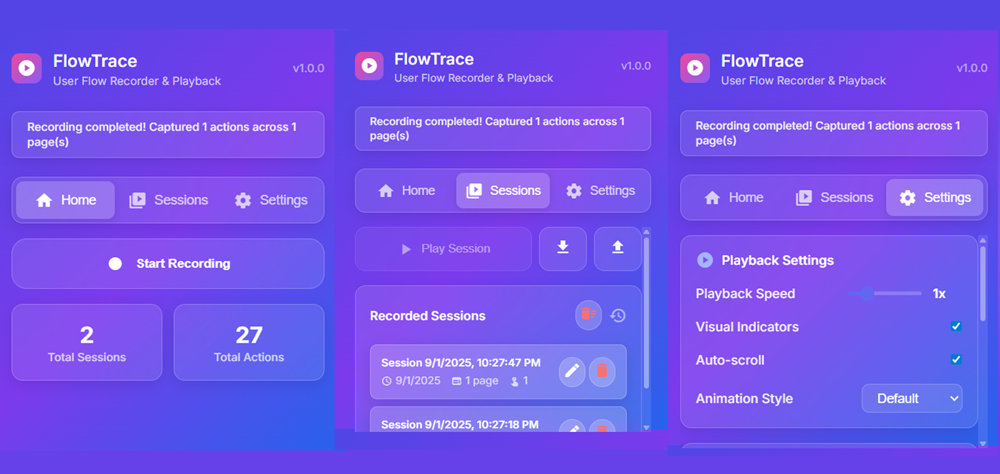

# FlowTrace - User Flow Tracing Browser Extension



A powerful browser extension for tracing user flows and interactions for comprehensive testing and debugging. FlowTrace captures user interaction patterns to help developers, testers, and UX researchers understand user behavior and optimize workflows.

## 🎯 Features

- **Flow Tracing**: Capture and trace all user interactions including clicks, keyboard input, scrolling, form submissions, and navigation
- **Real-time Monitoring**: Track user flows as they happen across web pages
- **Comprehensive Logging**: Generate detailed interaction logs for testing and debugging
- **Cross-Domain Support**: Works seamlessly on any website (http/https)
- **Developer Tools Integration**: Perfect for QA testing, bug reproduction, and user journey analysis
- **Lightweight Performance**: Minimal impact on page performance during tracing

## 📦 Installation

### From Source (Developer Mode)

1. **Clone or download this repository**

   ```bash
   git clone <repository-url>
   cd FlowTrace
   ```

2. **Open Chrome and navigate to Extensions**

   - Go to `chrome://extensions/`
   - Enable "Developer mode" (toggle in the top right)

3. **Load the extension**

   - Click "Load unpacked"
   - Select the folder containing the extension files
   - The extension should now appear in your extensions list

4. **Pin the extension** (optional)
   - Click the puzzle piece icon in the toolbar
   - Find "FlowTrace" and click the pin icon

## 🚀 Usage

### Starting Flow Tracing

1. **Navigate to the webpage** you want to analyze
2. **Click the FlowTrace extension icon** in the browser toolbar
3. **Click "Start Tracing"** to begin capturing user interactions
4. **Perform your actions** on the webpage:
   - Click buttons, links, and other elements
   - Type in input fields
   - Scroll the page
   - Submit forms
   - Navigate between pages
5. **Click "Stop Tracing"** when finished
6. View the captured flow data and interaction patterns

### Analyzing Flow Data

1. **Open the extension popup** to view recent traces
2. **Review interaction logs** and timing data
3. **Export flow data** for further analysis or sharing
4. **Use insights** to optimize user experience and identify pain points

## 🛠️ Technical Details

### What Gets Traced

FlowTrace captures comprehensive user interaction data:

- **Mouse Events**: clicks, double-clicks, mouse movements
- **Keyboard Events**: key presses, input changes
- **Navigation Events**: page loads, URL changes
- **Form Interactions**: input changes, form submissions
- **Scroll Events**: page and element scrolling
- **Timing Data**: interaction timestamps and durations

### Trace Data Structure

Each traced interaction includes:

```javascript
{
  type: "click",           // Interaction type
  timestamp: 1500,         // Time offset from trace start (ms)
  target: "#submit-btn",   // CSS selector of target element
  coordinates: {           // Mouse coordinates (if applicable)
    x: 100, y: 200,       // Viewport coordinates
    pageX: 100, pageY: 800 // Page coordinates
  },
  key: "Enter",           // Key pressed (for keyboard events)
  value: "user input",    // Input value (for form events)
  scrollPosition: {       // Current scroll position
    x: 0, y: 400
  },
  url: "https://example.com", // Current page URL
  viewport: {             // Browser viewport size
    width: 1920, height: 1080
  }
}
```

## 🎨 Customization

### Modifying Trace Filters

You can customize what interactions get traced by editing the event listeners in `content.js`:

```javascript
// Add custom event filtering
if (this.shouldTraceEvent(event)) {
  this.traceInteraction(event.type, event);
}
```

### Adding Custom Trace Types

To trace additional interactions, modify the `addEventListeners` method in `content.js`:

```javascript
// Add new event listener
document.addEventListener("your-event", this.handleCustomEvent, true);

// Add corresponding handler
handleCustomEvent = (event) => {
  this.traceInteraction("custom-event", event);
};
```

## 🔧 Development

### File Structure

```
FlowTrace/
├── manifest.json          # Extension configuration
├── popup.html            # Extension popup UI
├── popup.js             # Popup logic and controls
├── content.js           # Main tracing logic
├── background.js        # Background service worker
├── icons/              # Extension icons (16x16, 32x32, 48x48, 128x128)
├── flowtrace-preview.jpg           # Preview images and screenshots
└── README.md           # This file
```

### Building for Production

1. **Create extension icons** (16x16, 48x48, 128x128 pixels)
2. **Test thoroughly** on different websites
3. **Package for Chrome Web Store** (if desired)

## 🤝 Use Cases

### For QA Testers

- **Bug Reproduction**: Trace the exact steps that led to a bug for easier debugging
- **Test Coverage Analysis**: Understand which parts of the application are being tested
- **User Journey Validation**: Verify that critical user flows work as expected
- **Regression Testing**: Monitor changes in user interaction patterns over time

### For UX Researchers

- **User Behavior Analysis**: Understand how users naturally interact with your interface
- **Usability Testing**: Identify pain points and areas for improvement
- **Interaction Patterns**: Discover common user flows and optimize accordingly
- **A/B Testing Support**: Compare user interaction patterns across different designs

### For Developers

- **Performance Monitoring**: Identify slow interactions and optimize accordingly
- **Feature Usage Analytics**: See which features users actually interact with
- **Error Tracking**: Trace user actions leading up to JavaScript errors
- **Accessibility Testing**: Monitor keyboard navigation and screen reader interactions

## ⚠️ Important Notes

- **Privacy**: FlowTrace only captures interaction metadata, not sensitive data like passwords or personal information
- **Performance**: Tracing has minimal impact, but extended sessions may accumulate data
- **Compatibility**: Works with Chrome/Chromium-based browsers (Chrome, Edge, Brave, etc.)
- **Scope**: Traces webpage interactions only, not browser UI elements
- **Data Storage**: Trace data is stored locally in your browser

## 🐛 Troubleshooting

### Extension Not Working

1. Check that Developer Mode is enabled in `chrome://extensions/`
2. Reload the extension and refresh the webpage
3. Ensure you're on an http/https page (not chrome:// pages)

### Tracing Not Starting

1. Make sure the page has fully loaded before starting
2. Check browser console for error messages
3. Verify that the website allows content scripts

### Data Not Appearing

1. Check that tracing was properly started and stopped
2. Ensure local storage permissions are enabled
3. Try clearing extension data and restarting

## 📝 License

This project is open source and available under the MIT License.

## 🤝 Contributing

Contributions are welcome! Please feel free to submit pull requests or open issues for bugs and feature requests.

---

**Happy Tracing!** 🚀
